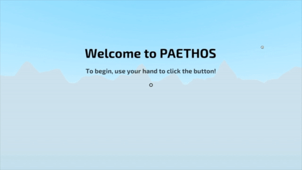

# Paethos

A virtual reality experience that utilizes EEG sensors to turn brainwaves into an interactive and educational art piece. Submission for Carnegie Mellon's 11th Build18 Hack-a-thon.

### Preview:

### Technology Used:
- OpenBCI's Ganglion
  - Electrode data sent through Bluetooth to OpenBCI's GUI
  - GUI power band data streamed to a Node server with UDP
- Oculus Quest
  - Built VR experience with WebVR library A-Frame

### Scenes
- Scene I: Dreamless Sleep (Delta Waves)
- Scene II: Daydreaming (Theta Waves)
- Scene III: Waking Up (Alpha Waves)
- Scene IV: Active Mind (Beta Waves)
- Scene V: Nirvana (Gamma Waves)

### Soundtrack
To listen to the soundtrack, visit: https://soundcloud.com/izofar/sets/paethos-original-soundtrack
